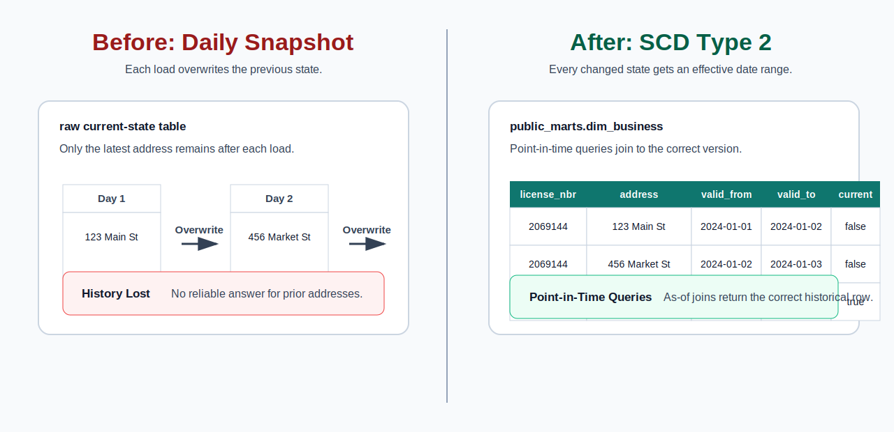
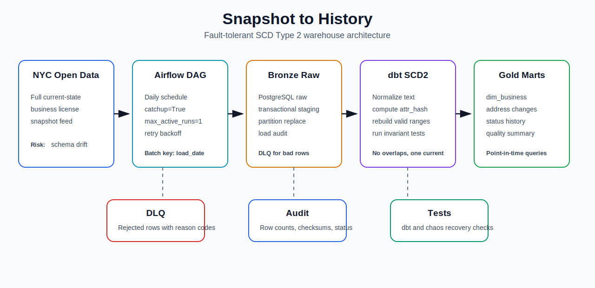

# Snapshot to History: SCD Type 2 Business Registry Warehouse


**A batch warehouse that turns overwrite-only business-license snapshots into queryable point-in-time history.**

NYC Open Data publishes a current-state business license feed. A naive load overwrites yesterday's values and permanently loses prior addresses, statuses, and license attributes. This pipeline uses `load_date` as the batch boundary: raw loads replace one date partition transactionally, dbt computes normalized `attr_hash` values, and `dim_business` rebuilds effective ranges so retries and backfills do not create duplicate current rows.



## Quickstart

```bash
git clone https://github.com/mathew-felix/snapshot-to-history.git
cd snapshot-to-history
cp .env.example .env
make run
```

`make run` starts PostgreSQL, loads the committed 2,000-row sample snapshot, runs dbt snapshot/run/test, and prints the warehouse summary. The sample is intentionally small so reviewers can run the project locally without depending on the live API.

```text
=========== SCD2 BUSINESS REGISTRY - RUN SUMMARY ===========
Snapshot date             : 2026-06-27
Raw rows ingested         : 2,000
Total versions in history : 2,000
Current rows (is_current) : 2,000
Unique active businesses  : 2,000
Current row check (direct): 2,000
=============================================================
```

## Architecture



```text
NYC Open Data API
  -> Airflow DAG logical date and retry policy
  -> raw.businesses_snapshot plus audit and DLQ tables
  -> dbt staging normalization, casting, dedupe, attr_hash
  -> public_marts.dim_business repaired SCD2 ranges
  -> analytical marts and invariant tests
```

The Airflow DAG in `dags/business_registry_scd2_daily.py` mirrors the local task order for scheduled execution:

| Setting | Value | Why it matters |
|---|---|---|
| `schedule` | `0 6 * * *` | Daily batch after source refresh window. |
| `catchup` | `True` | Missed dates can be replayed as historical batches. |
| `max_active_runs` | `1` | Prevents concurrent SCD2 mutations for different dates. |
| `retries` | `3` | Allows transient extract/load/dbt failures to retry. |
| `retry_exponential_backoff` | `True` | Avoids hammering the source or database after repeated failures. |
| `{{ ds }}` | Passed to extract/load/dbt | Keeps Airflow logical date aligned with warehouse `load_date`. |

## Operational Guarantees

| Guarantee | Mechanism | Artifact |
|---|---|---|
| Retry for the same date does not duplicate raw rows | Advisory lock plus delete/insert inside one PostgreSQL transaction | `src/load_raw.py` |
| Bad records do not silently disappear | Missing `license_nbr` rows are written with reason codes | `raw.businesses_snapshot_dlq` |
| Source schema drift is queryable after failure | Header profile is persisted before required-column failures abort the load | `staging.schema_drift_events` |
| Backfills do not corrupt current rows | `dim_business` derives ranges from all staged snapshots ordered by `load_date` | `dbt/models/marts/dim_business.sql` |
| Invalid SCD2 state fails the build | dbt singular tests enforce one current row and no overlaps | `dbt/tests/` |

Raw partition replacement follows this transaction shape:

```sql
BEGIN;
SELECT pg_advisory_xact_lock(hashtext('business_registry_scd2:' || :load_date));
CREATE TEMP TABLE businesses_snapshot_stage (...);
-- insert rows, route rejects, validate staged count
DELETE FROM raw.businesses_snapshot WHERE load_date = :load_date;
INSERT INTO raw.businesses_snapshot SELECT * FROM businesses_snapshot_stage;
COMMIT;
```

## Failure Modes Tested

| Incident | Expected failure | Recovery behavior |
|---|---|---|
| Required source column is missing | Loader raises before raw mutation | Drift event persists in `staging.schema_drift_events`; raw partition remains unchanged. |
| Row is missing `license_nbr` | Row cannot be keyed for SCD2 | Record lands in `raw.businesses_snapshot_dlq`; valid rows continue loading. |
| Older snapshot arrives after a newer snapshot | Snapshot arrival order no longer matches business effective order | `dim_business` rebuilds windows from ordered staged history. |
| Failure after staging but before commit | Transaction aborts | Previous committed `load_date` partition remains intact. |

## Data Quality Gates

```bash
make test
```

Coverage includes:

- `10` Python tests for extraction, idempotent loading, DLQ behavior, schema drift, rollback, and late-arrival repair.
- `13` dbt tests for source not-null checks, SCD2 uniqueness, one-current-row guarantees, and no overlapping validity windows.

Core SCD2 invariants:

- `assert_one_current_per_key`: no `license_nbr` has more than one current row.
- `assert_no_overlapping_ranges`: no two versions for the same business overlap in effective time.

## Warehouse State

| Layer | Object | Purpose |
|---|---|---|
| Bronze | `raw.businesses_snapshot` | Full source snapshot rows stored as text plus `load_date` and `ingested_at`. |
| Bronze | `raw.businesses_snapshot_dlq` | Rejected records with source row number and reject reason. |
| Bronze | `raw.businesses_snapshot_load_audit` | One audit record per logical load date with row counts and checksum. |
| Silver | `public_staging.stg_businesses` | Clean typed rows, normalized tracked attributes, deterministic `attr_hash`. |
| Gold | `public_marts.dim_business` | Repaired SCD Type 2 dimension with `valid_from`, `valid_to`, `is_current`. |

## Airflow DAG

The DAG task graph is:

```text
validate_runtime_config
  -> extract_snapshot_to_local
  -> profile_source_schema
  -> load_raw_replace_partition
  -> dbt_deps_compile
  -> dbt_source_freshness
  -> dbt_run_staging
  -> dbt_snapshot_scd2
  -> dbt_run_gold_marts
  -> dbt_test_invariants
  -> publish_run_summary
  -> archive_dbt_artifacts
```

Local verification runs through Docker Compose. The Airflow DAG is authored for deployment in an Airflow worker image with the same Python/dbt dependencies.

## Key Files

- `src/load_raw.py`: transactional raw partition replacement, schema profiling, DLQ routing.
- `dbt/models/marts/dim_business.sql`: SCD2 effective dating rebuilt from staged history.
- `dags/business_registry_scd2_daily.py`: scheduled DAG with logical-date propagation and retry controls.
- `tests/test_chaos_recovery.py`: schema drift, late-arrival, and rollback tests.

## Known Limits

- Local execution uses Docker Compose and PostgreSQL, not managed AWS infrastructure.
- The Airflow DAG is deployment-ready but not required for `make run`.
- The committed sample is 2,000 rows; live extraction is supported separately through `src/extract.py`.
- The repaired SCD2 model rebuilds ranges from staged history. That is correct for this dataset size; a much larger dimension would need partitioned incremental repair.
